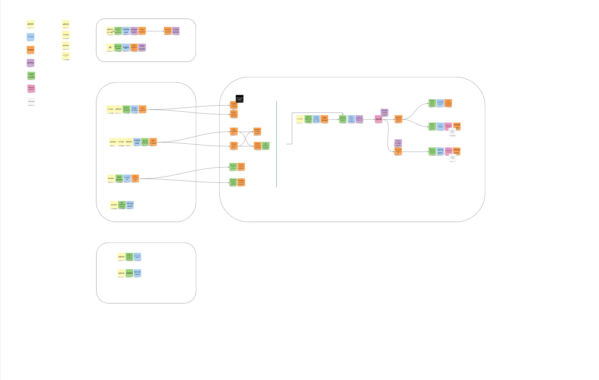
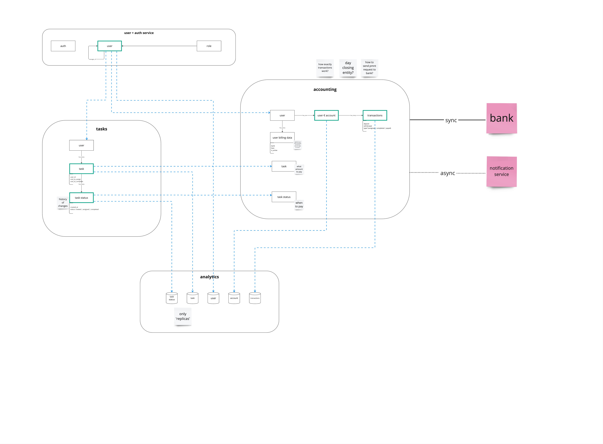

# AA VI: week 01

1. Event Storming
2. Data Model
3. Communication Model

[Miro board](https://miro.com/app/board/uXjVNu6gyn0=/?share_link_id=105612972961) (pass: `asyncarch06`)

## Modules

There will be 3 main entities (plus one additional: analytics) in the system:

1. Auth + User service
2. Tasks service
3. Accounting
4. Analytics

## Architecture

### Event Storming

### Data Model

### Communication Model

